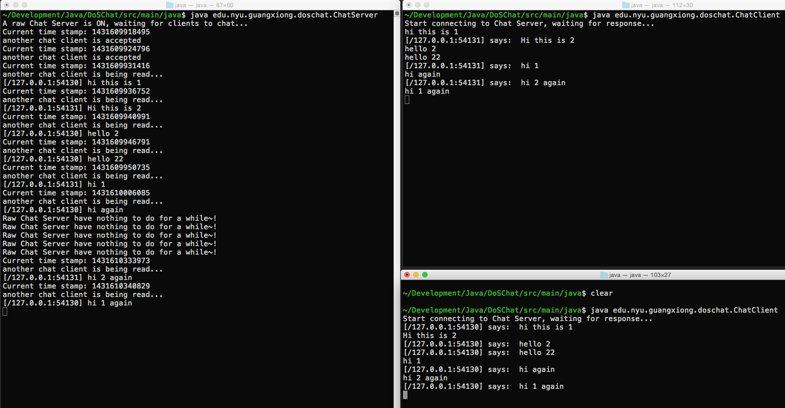
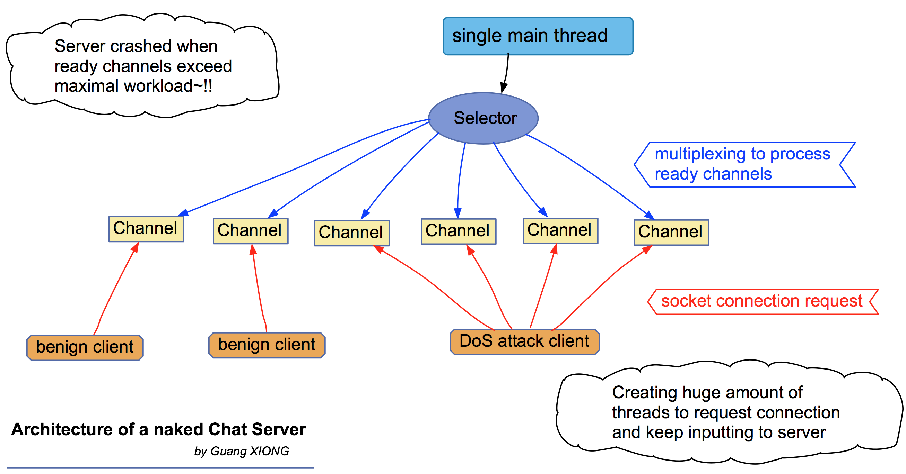
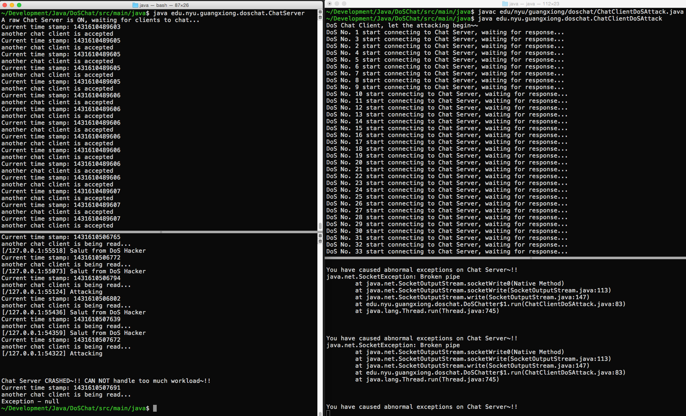

# DoS-Chat

Java implementation of a single-threaded NIO-based chat server which defends against DoS attacks from multi-threaded chat clients. For comparison, a chat server without DoS defense and a benign chat client are also implemented.
 

 
## Architecture of a Naked Chat Server 
 

 
## Crashed when DoS Attack 
 

 
## Video Demo 
 

